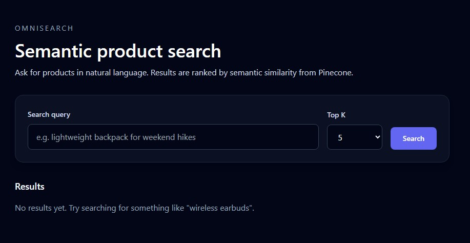

# OmniSearch

OmniSearch is a full-stack semantic product search system that enables natural-language discovery over unstructured product data. It uses OpenAI embeddings and Pinecone’s vector index to map user queries to high-dimensional product representations, with a FastAPI backend and a Next.js frontend for real-time search.

## Features
- Semantic search UI with natural language queries
- FastAPI backend that normalizes queries, generates embeddings, and queries Pinecone
- In-memory embedding cache to reduce latency
- Seed script for sample product vectors
- Docker Compose setup for local development

## Architecture
1. **Frontend** collects a user query and sends it to `POST /search`.
2. **Backend** normalizes the query, generates embeddings asynchronously, caches embeddings, and queries Pinecone.
3. **Pinecone** returns top matches with metadata, which the backend returns to the UI.

## Getting Started

### Prerequisites
- Node.js 18+
- Python 3.11+
- Pinecone account and index
- OpenAI API key

### Environment Variables
Copy `.env.example` to `.env` and fill in your secrets:

```bash
cp .env.example .env
```

Required values:
- `OPENAI_API_KEY`
- `PINECONE_API_KEY`
- `PINECONE_INDEX_NAME`

### Run with Docker Compose

```bash
docker-compose up --build
```

Frontend runs at `http://localhost:3000` and backend at `http://localhost:8000`.

### Seed Sample Products

```bash
python backend/seed.py
```

This reads `backend/data/sample_products.json`, generates embeddings, and upserts them to Pinecone.

### Run locally without Docker

```bash
cd backend
python -m venv .venv && source .venv/bin/activate
pip install -r requirements.txt
uvicorn app.main:app --reload --port 8000
```

```bash
cd frontend
npm install
npm run dev
```

## API

### `POST /search`

**Body**
```json
{
  "query": "wireless earbuds for workouts",
  "top_k": 5
}
```

**Response**
```json
{
  "results": [
    {
      "id": "42",
      "score": 0.87,
      "title": "Trail Backpack",
      "description": "Lightweight pack",
      "category": "outdoors",
      "price": 79.99
    }
  ]
}
```

## Tests

```bash
cd backend
pytest
```

## Scripts

- `make dev` - run Docker Compose
- `make seed` - seed Pinecone vectors
- `make test` - run backend tests

## Notes
- Ensure your Pinecone index dimensionality matches the embedding model you configure.
- Secrets are loaded from `.env`. Do not commit your real keys.

## Finished Product (UI Preview)

